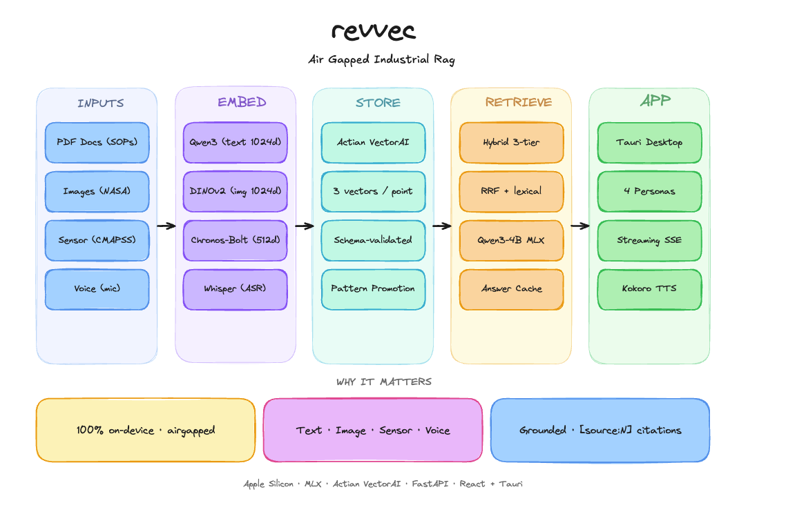
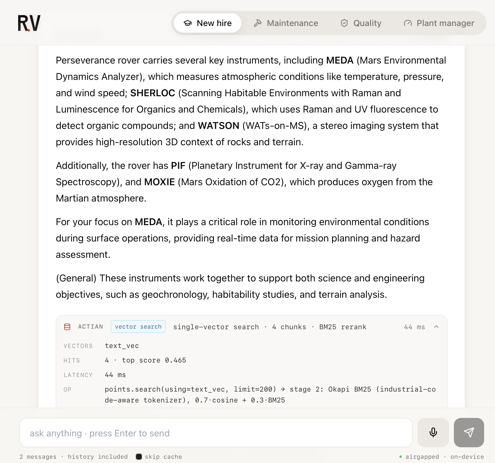
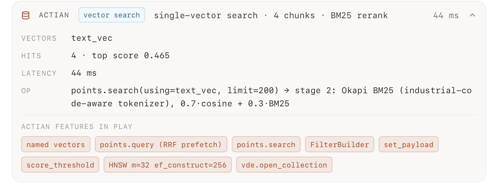
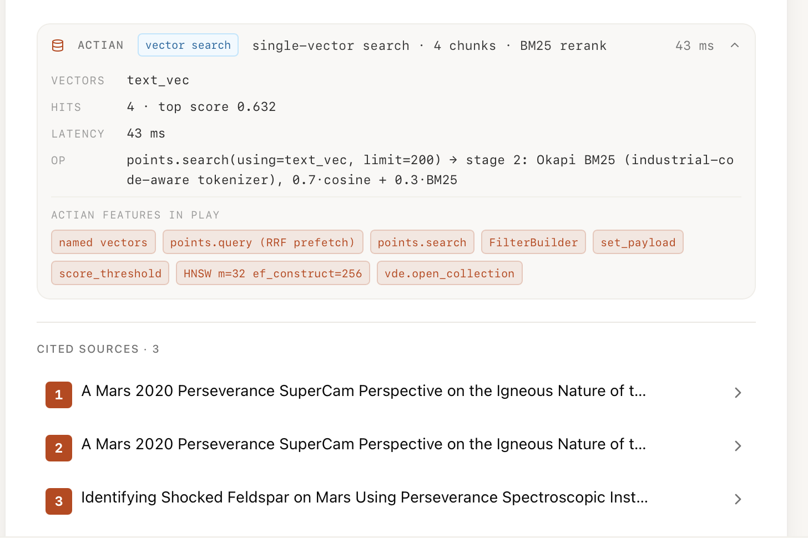
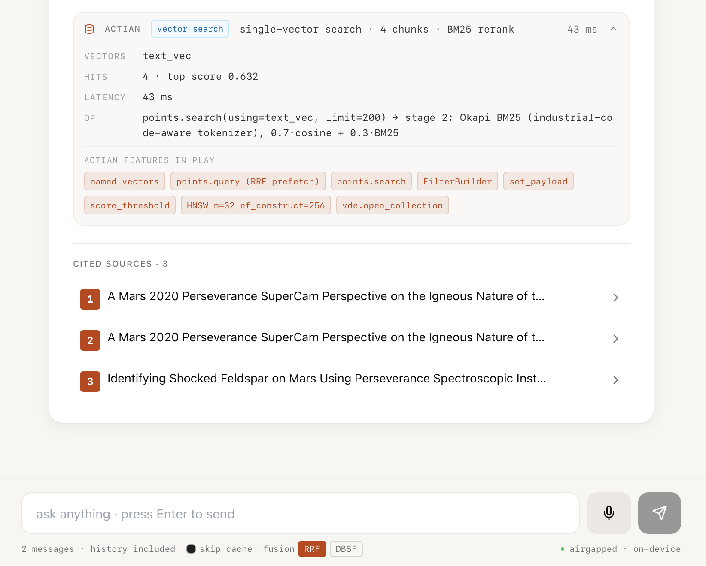
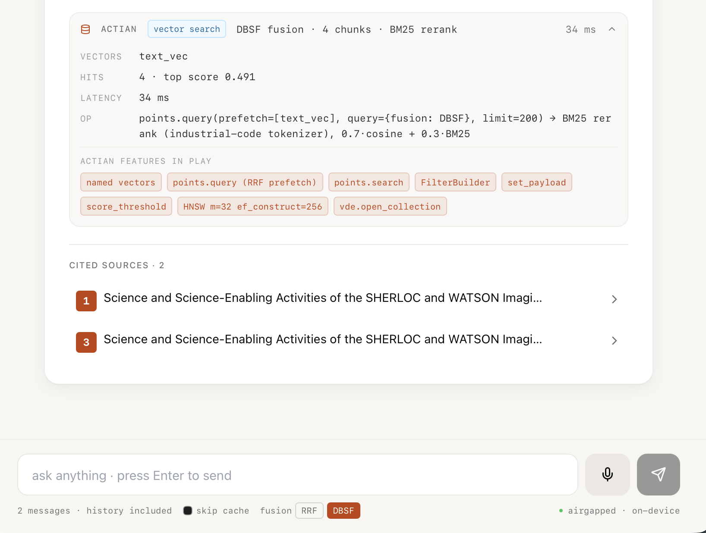

# revvec

Airgapped industrial RAG. On device. No cloud.

🌐 [revvec.vercel.app](https://revvec.vercel.app/) &nbsp;·&nbsp; 📺 [3 minute demo](https://youtu.be/h3Z-lNdBV6o)

Submission for the **Actian VectorAI DB Build Challenge**, April 2026.

## Why this exists

Defense, aerospace, pharma, semiconductor, EU critical infrastructure. None of them can ship their SOPs, sensor data, or mission docs to a cloud LLM. CMMC, ITAR, 21 CFR Part 11, NIS2 say no.

revvec runs every model and every byte of your data on a single Mac. Pull the ethernet cable and it still answers, still cites, still works.

## Architecture



Five stages, one Mac, zero hops. Inputs (PDFs, images, sensor windows, voice) go through five embedding models, all named vectors land in one Actian collection, retrieval is a three tier hybrid (server side RRF prefetch + Okapi BM25 rerank + answer cache), and the response streams from Qwen3-4B with `[source:N]` citations.

## What ships

* **Mac `.app`** with multi chat sidebar, streaming token answers, live voice transcription, inline `[source:N]` citation pills that open the cited PDF at the cited page.
* **FastAPI sidecar** running locally on `127.0.0.1:8000`. Every endpoint is `async def` because MLX GPU streams are thread local on macOS.
* **Actian VectorAI DB** in Docker on `localhost:50052`. One collection `revvec_memory`. Three named vectors per point.
* **Hash chained audit log** (SHA-256 over canonical JSON, JSONL per UTC day). 6 of 6 tamper tests pass.
* **NASA Mars 2020 corpus**. Public domain, ITAR plausible, abundant.

## Screenshots

A grounded answer with the four engineer personas, the source PDF panel sliding in on the right, and the Actian inspector dropdown at the bottom of every answer.



The Actian inspector strip. One click expands it and surfaces every Actian primitive the query exercised. Vector search path, vectors used, hits returned with top score, latency split between Actian and the BM25 rerank, the actual operation as pseudocode, and a chip cloud of the Actian features in play.



Citations resolve to real `entity_id`s. Click an orange pill and the source PDF opens at the cited page with the cited phrase highlighted.



Live fusion mode toggle. Every query is routed through `points.query(prefetch=[...], query={fusion: ...})`. Switch between RRF and DBSF mid-session and the Inspector reflects the mode you picked.





## Run it

```bash
make install     # Python 3.12 via uv (one time)
make up          # start Actian in Docker
make serve       # start FastAPI sidecar (blocks)

# in another terminal
make app         # opens the bundled .app
```

Built artifacts after a release build:

* `app/src-tauri/target/release/bundle/macos/revvec.app`
* `app/src-tauri/target/release/bundle/dmg/revvec_0.1.0_aarch64.dmg` (about 3.1 MB)

## Stack

| Slot | Model |
|---|---|
| LLM | `Qwen3-4B-Instruct-2507-4bit` via MLX |
| Text embed | `Qwen3-Embedding-0.6B` (1024d) |
| Image embed | `DINOv2-large` (1024d) |
| Sensor embed | `Chronos-Bolt-small` (512d) |
| ASR | `Whisper-large-v3-turbo` via mlx-whisper |
| TTS | `Kokoro-82M` |
| Vector DB | Actian VectorAI DB (Docker, port 50052) |
| Frontend | Tauri 2 + React 19 + Tailwind |
| Backend | FastAPI + Uvicorn (Python 3.12, uv) |

All Apache-2.0 or ungated. No cloud API at runtime. Weights live in `~/.cache/huggingface/`.

## Numbers

| | |
|---|---|
| P95 retrieval | 68 ms |
| Cache hit P95 | 9 ms |
| Fabricated citations | 0 |
| Audit tamper tests | 6 / 6 |
| `.dmg` size | 3.1 MB |

## Why Actian is load bearing

1. **Three named vectors on one point**, one shared payload. A PDF page becomes one record holding both a text vector and an image vector. ColPali inspired.
2. **Server side RRF fusion** via `client.points.query(prefetch=...)`. One round trip across all named vectors. About 15 ms on a 1,940 point corpus.
3. **`set_payload` for in place state transitions.** Pattern promotion (candidate to active) without re-embedding the vector.
4. **`points.search(score_threshold=0.95)` for the answer cache.** One server call combines a cosine threshold with a payload filter. Cache hits in 9 ms.
5. **`FilterBuilder` DSL** for compliance flavoured queries. Forget by `entity_id`, scope by equipment, scope by time range.
6. **HNSW tuned at create time** (`m=32, ef_construct=256`). Schema is locked, never mutated.
7. **`vde.open_collection()` on every `ensure_ready()`.** Actian's beta `collections.exists()` lies after a server restart, so the writer always re-mounts. Robust to Docker bounces.
8. **Industrial code aware Okapi BM25 reranker** stitched on top of the Actian stage one pool. Tokenizer keeps codes like `SOP-ME-112` and `sol 1214` intact (codes embeddings have never seen). 0.7·cosine + 0.3·BM25 with a graceful fallback.

Take Actian out and you would need four databases plus a client side merge layer.

## Architecture (code)

Nine single file agents under `src/revvec/`:

```
ingestion/orchestrator.py    fans to sop, image, sensor, voice, log
embed/service.py             lazy-loads all 5 models with TTL unload
memory/actian_writer.py      sole writer into Actian
cluster/promotion.py         candidate -> active state machine
retrieval/hybrid.py          RRF prefetch + BM25 rerank + answer cache
llm/qwen_mlx.py              Qwen3-4B via MLX
voice/stt_tts.py             Whisper + Kokoro + live streaming
audit/chain.py               hash chained JSONL
persona/router.py            persona specific prompt overlays
```

The web landing page lives in `web/` (Next.js, deployed to Vercel).

## Compliance

Hash chained audit log over canonical JSON. Every query, cache hit, and forget request gets recorded. Verify with `GET /api/admin/audit`. Tamper any byte and the next verify call returns `chain_ok: false`.

Maps to CMMC 2.0 SP.3.1, ITAR 22 CFR 120, 21 CFR Part 11 §11.10(e), NIS2 Art. 21, GDPR Art. 17. Honest about gaps. No auth on admin endpoints yet, and `vde.save_snapshot` returns `UNIMPLEMENTED` on the current Actian beta (the audit row is written either way).

## License

Apache-2.0. Models keep their own licences.
